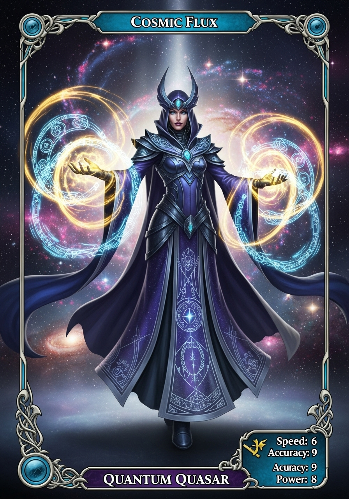
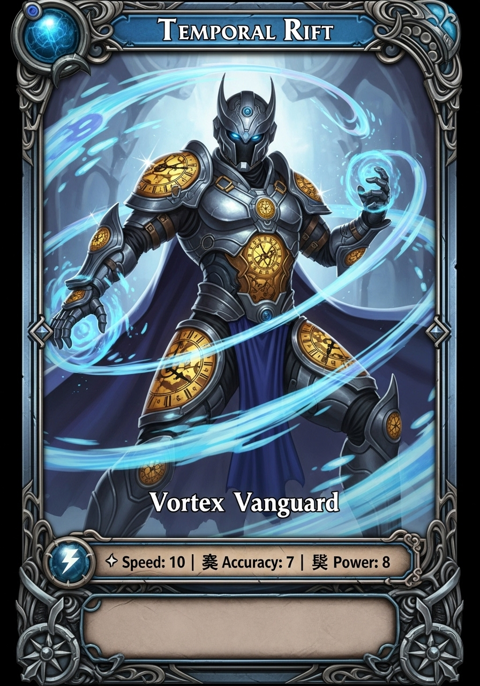
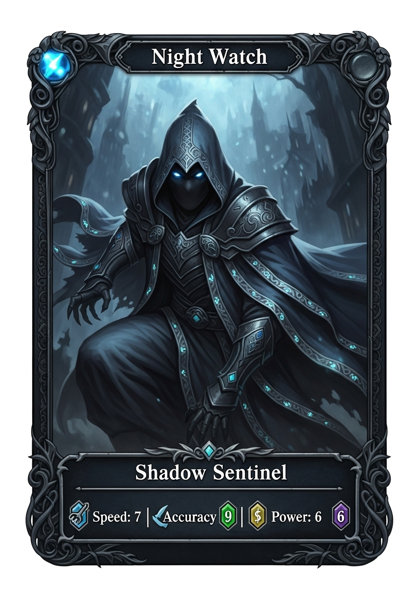
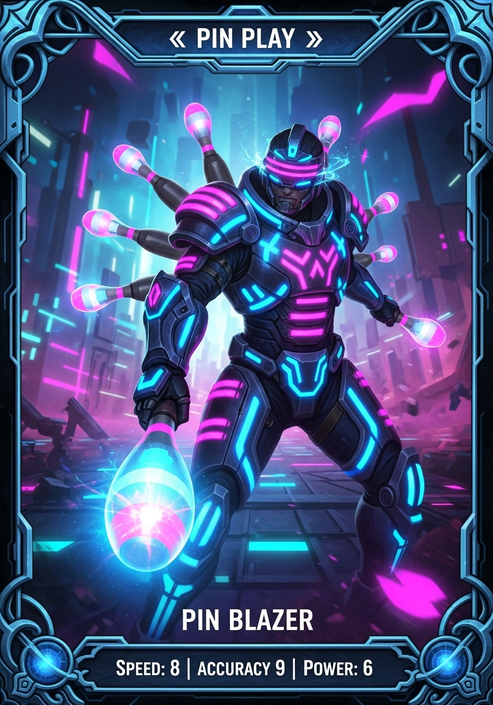
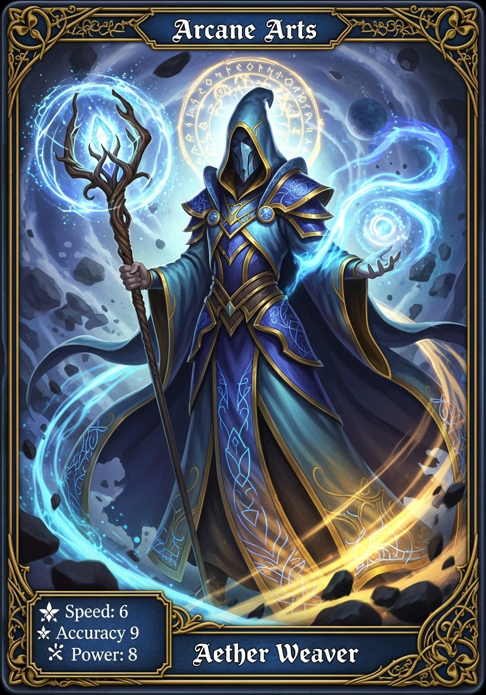

# 🎮 KRW Game Credits - User Guide

## 🚀 **Live NFT Marketplace Ready!**

Your NFTs are now deployed and available for purchase! Here's how users can start buying:

## 📋 **Available NFTs in Marketplace**

| NFT | Rarity | Price | Image | Description |
|-----|--------|-------|-------|-------------|
| **Quantum Quasar Blade** | Legendary (5⭐) | 25,000 KRWGC |  | A legendary sword that cuts through dimensions |
| **Vortex Vanguard Armor** | Epic (4⭐) | 10,000 KRWGC |  | Epic armor channeling cosmic vortex power |
| **Shadow Sentinel Plate** | Epic (4⭐) | 10,000 KRWGC |  | Epic armor forged from shadow essence |
| **Pin Blazer Shield** | Rare (3⭐) | 4,000 KRWGC |  | Rare shield blazing with protective energy |
| **Aether Weaver Elixir** | Uncommon (2⭐) | 1,500 KRWGC |  | Uncommon potion weaving aether magic |

## 🔧 **How to Connect & Purchase**

### **Step 1: Add Local Network to MetaMask**
1. Open MetaMask
2. Click network dropdown → "Add network"
3. Add custom network:
   - **Network Name**: `KRW Game Credits Local`
   - **New RPC URL**: `http://localhost:8545`
   - **Chain ID**: `1337`
   - **Currency Symbol**: `ETH`

### **Step 2: Import Test Account**
Import one of these test accounts to get free ETH and KRWGC:

**Account #1 (Deployer - Has 100k KRWGC):**
- Address: `0xf39Fd6e51aad88F6F4ce6aB8827279cffFb92266`
- Private Key: `0xac0974bec39a17e36ba4a6b4d238ff944bacb478cbed5efcae784d7bf4f2ff80`

**Account #2 (Fresh User):**
- Address: `0x70997970C51812dc3A010C7d01b50e0d17dc79C8`
- Private Key: `0x59c6995e998f97a5a0044966f0945389dc9e86dae88c7a8412f4603b6b78690d`

### **Step 3: Get KRW Tokens**
1. Visit the **Wallet** page
2. Click "**Mint Test Tokens**" to get 10,000 KRWGC
3. Check your balance updates

### **Step 4: Buy NFTs**
1. Go to **Marketplace** page
2. Browse available NFTs with real card artwork
3. Click "**Buy Now**" on any item
4. Confirm the transaction in MetaMask
5. NFT appears in your wallet!

## 🎯 **Contract Addresses**
- **KRW Stablecoin**: `0x5FbDB2315678afecb367f032d93F642f64180aa3`
- **Game Item NFT**: `0xe7f1725E7734CE288F8367e1Bb143E90bb3F0512`
- **Game Marketplace**: `0x9fE46736679d2D9a65F0992F2272dE9f3c7fa6e0`

## 🎨 **Features**
- ✅ **Real NFT Cards**: Each item displays beautiful card artwork
- ✅ **Rarity System**: 5 rarity levels with different pricing
- ✅ **Live Blockchain**: Real contract interactions
- ✅ **Instant Transfers**: NFTs appear immediately after purchase
- ✅ **KRW Payments**: Use Korean stablecoin for transactions

## 🔴 **Live Demo Access**
- **App URL**: https://pin-play-7rl9.vercel.app
- **Local Dev**: http://localhost:3001
- **Network**: Hardhat Local (Chain ID: 1337)

## 🎮 **Start Playing!**
Your marketplace is ready with 5 unique NFTs available for purchase. Users can connect their wallets and start buying immediately!

---
*Built for Korea Stablecoin Hackathon 2024* 🇰🇷
